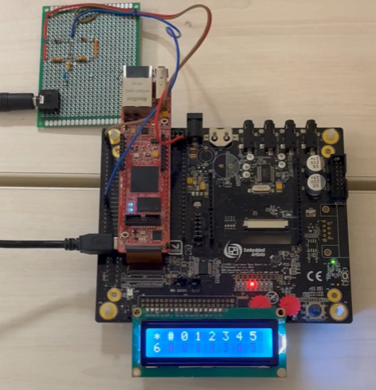

<h1 align="center"> Group 4 </h1>

 Keith Farrugia, Jonas Rousseau-Morvan

 Gabriel Vella, Alessandro Parrella

___

  

## SVN Command-List
<table> 
    <tr>
        <th style="width: 10em;"><b>Command</b></th>
        <th style="width: 20em;"><b>Description</b></th>
    </tr>
    <tr>
        <th>svn add &lt;name of file&gt;</th>
        <th>Add a file to SVN list</th>
    </tr>
    <tr>
        <th>svn commit --message "  Hello World   "</th>
        <th>Commit and push to svn</th>
    </tr>
    <tr>
        <th>svn update</th>
        <th> Update the current repository to match the one on SVN</th>
    </tr>
    <tr>
        <th>svn cleanup . --remove-unversioned</th>
        <th>Cleanup svn repository</th>
    </tr>
</table>

## Make Command-List

<table> 
    <tr>
        <th style="width: 10em;"><b>Command</b></th>
        <th style="width: 20em;"><b>Description</b></th>
    </tr>
    <tr>
        <th>make</th>
        <th>generate pdf from latex</th>
    </tr>
    <tr>
        <th>make clean</th>
        <th> Remove all files apart from the latex</th>
    </tr>
</table>

## Doxygen
<table> 
    <tr>
        <th style="width: 10em;"><b>Command</b></th>
        <th style="width: 20em;"><b>Description</b></th>
    </tr>
    <tr>
        <th>doxygen doxyfile</th>
        <th>run in code/trunk/src to generate doxygen documentation</th>
    </tr>
</table>